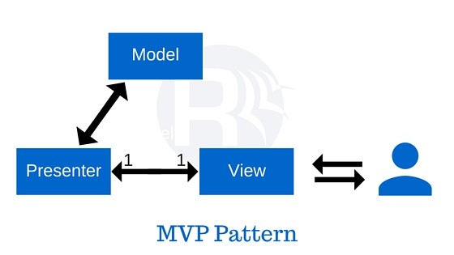

# MVP

MVP 模式类似于 [MVC 模式](./mvc.md)，其中 Controller 被 Presenter 取代。
这种模式将一个应用程序分为三个主要方面：

- 模型（Model）
- 视图（View）
- 演示者（Presenter）

## Model

模型表示解释业务逻辑即业务模型和数据模型（数据访问操作）的类的集合。
它还定义了数据的业务规则，即如何改变和操作数据。

## View

视图表示用户界面组件。
视图显示从 Presenter 接收到的数据作为结果。
这也就把模型变成了用户界面。

## Presenter

Presenter 负责代表视图处理所有的用户界面事件。
它通过 View 接收用户的输入，然后通过 Model 处理用户的数据，将结果传回 View。
与 View 和 Controller 的关系不同，View 和 Presenter 是完全分离的，彼此之间通过一个接口进行通信。
Presenter 也不像 controller 那样处理传入的请求流量。
