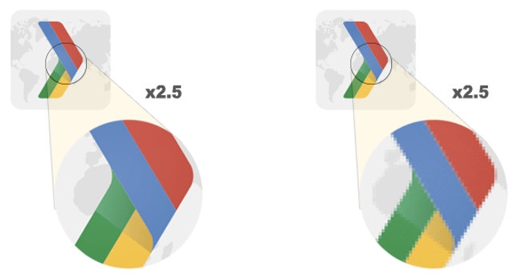

# WEB 图片优化

放置合理的图像可以传达更多信息。
但是图像会耗费大量资源，并且通常还占用大量可视空间。
所以对于图片的优化是 WEB 性能优化的重中之重。

一个好用的图片转换站点：[squoosh](https://squoosh.app/)

## 图像类型

图像类型主要分为以下两类

- 矢量图形
- 光栅图形

### 矢量图形

[矢量图形（Vector Graphics）](https://baike.baidu.com/item/%E7%9F%A2%E9%87%8F%E5%9B%BE) 使用线，点和多边形来表示图像

### 光栅图形

[光栅图形（Raster Graphics）](https://baike.baidu.com/item/%E5%85%89%E6%A0%85%E5%9B%BE%E5%83%8F) 通过对矩形网格内每个像素的单独值进行编码来表示图像。

光栅图像只是单个“像素”的二维网格，例如 100x100 像素图像是 10,000 像素的序列。
每个像素依次存储 RGBA 值：（R）红色通道，（G）绿色通道，（B）蓝色通道和（A）alpha（透明）通道。
浏览器为每个通道分配 256 个值（阴影），即每个通道转换为 8 位（2 ^ 8 = 256），每个像素转换为 4 个字节（4 个通道 x 8 位= 32 位= 4 字节）。

因此，像素数越大，光栅图像的文件大小就越大。
例如，以 100x100（CSS）像素显示的照片资产之间的区别：

| 屏幕分辨率 | 总像素                 | 未压缩的文件大小（每像素 4 个字节） |
| :--------- | :--------------------- | :---------------------------------- |
| 1 倍       | 100 x 100 = 10,000     | 40,000 字节                         |
| 2 倍       | 100 x 100 x 4 = 40,000 | 160,000 字节                        |
| 3 倍       | 100 x 100 x 9 = 90,000 | 360,000 字节                        |

## 选择正确的图像

### 不使用图片

好的设计很简单，而且始终会产生最佳性能。
不是所有的设计的实现都必须使用图片。
图像通常相对于页面上的 HTML，CSS，JavaScript 和其他资产需要大量字节，
如果可以不使用图像，那么这始终是最佳的优化策略。

可以考虑是否可以通过以下实现替代图片：

- **CSS 效果**（例如阴影或渐变）和 CSS 动画可用于生成与分辨率无关的资产，这些资产在每个分辨率和缩放级别始终看起来清晰，通常仅占图像文件所需字节的一小部分。
- **Web 字体** 使用户可以使用漂亮的字体，同时保留选择，搜索和调整文本大小的能力，这是可用性的重大改进。

**中文站点绝对不要考虑自定义的 Web 字体，中文字体耗费的资源是巨大的。**

### 合理的图片设计

**避免图片中存在文本。**
图像中的文本会带来糟糕的用户体验：文本不可选择，不可搜索，不可缩放，不可访问且对高 DPI 设备不友好。

### 使用正确的图像类型

**尽可能选择矢量图像**，因为矢量图像与分辨率无关，并且始终可以提供清晰的结果。
**如果需要光栅图像，请提供响应图像。**

有两种不同的像素：CSS 像素和设备像素。
单个 CSS 像素由单个设备像素或多个设备像素支持。
设备像素越多，屏幕上显示内容的细节就越精细。

高 DPI（HiDPI）屏幕可产生漂亮的效果，但**图像资产需要更多细节才能利用更高的设备像素数。**



矢量格式非常适合包含简单几何形状（例如徽标，文本或图标）的图像。
在每种分辨率和缩放设置下都能提供清晰的结果，这使其成为需要以不同尺寸显示的高分辨率屏幕和资产的理想格式。

当场景复杂时，用于描述所有形状的 SVG 标记数量可能会过高，并且输出可能仍看起来不“真实感”。
此时应该使用光栅图像格式，例如 PNG，JPEG 或 WebP。

### 正确的图像格式

不同的光栅图像格式：

| 格式      | 透明度 | 动画 | 浏览器兼容性     |
| :-------- | :----- | :--- | :--------------- |
| PNG       | 是的   | 不   | 全部             |
| JPEG 格式 | 不     | 不   | 全部             |
| WebP      | 是的   | 是的 | 所有现代浏览器。 |

当然还有 Browser PNG, WebP2 等等.

WebP 格式通常会提供比旧格式更好的压缩效果，应尽可能使用。
如何合理的使用 WebP，可以参考 [webp 兼容性方案](../webp-compatibility.md) 以及 Next.js 的 Image Optimize 实现。

对于较旧的图像格式：

1. **如果需要以高分辨率保存精细的细节。**
   1. 如果图像资产包含文本，请不要使用该图片。
   2. 如果图像仅包含由几何形状组成的图像，考虑将其转换为**矢量（SVG）格式**
   3. 否则使用 PNG。除了选择调色板的大小之外，PNG 不会应用任何有损压缩算法。
2. 优化照片，屏幕截图或类似的图像，使用 JPEG。

JPEG 结合使用有损和无损优化来减少图像资产的文件大小。
尝试几种 JPEG 质量级别，以找到资产的最佳质量与文件大小的权衡。

## 正确的压缩图像

### 优化矢量图像

大多数基于矢量的绘图软件都可以创建 SVG 文件。
但是这些通过工具导出的 SVG 包含许多元数据。
例如图层信息，注释和 XML 名称空间，这些对于在浏览器中呈现通常是不必要的。

可以通过 [svgo](https://github.com/svg/svgo) 之类的工具进行优化。

由于 SVG 是基于 XML 的格式，因此还可以应用 GZIP 压缩来减小其传输大小。

### 优化光栅图像

如果图像仅使用几种颜色，一种简单的策略是将图像的“位深度”从每通道 8 位减少到更小。

> 无论用于将数据从服务器传输到客户端的图像格式如何，当浏览器对图像进行解码时，每个像素始终占用 4 个字节的内存。
> 对于大型图像和没有大量可用内存的设备（例如，低端移动设备），这可能是一个重要的约束条件。

由于眼睛的工作原理，我们通常可以舍弃一些有关每个像素的信息，以减少图像的文件大小.
例如人眼对不同颜色的敏感度不同，所以可以通过减少或增加这些颜色的调色板来优化颜色编码以解决此问题。

因此，典型的图像优化管道包括两个高级步骤：

- 使用有损滤镜处理图像，该滤镜消除了一些像素数据。
- 使用压缩像素数据的无损滤波器处理图像。

> 由于用于编码图像的算法不同，因此不同图像格式的质量级别不能直接比较：质量 90 JPEG 与质量 90 WebP 会产生非常不同的结果。
> 实际上，基于压缩器的实现，即使是相同图像格式的质量级别也可能会产生明显不同的输出。

## 用视频取代 GIF 动画

通过将大型 GIF 转换为视频，可以节省用户带宽。
有多种方法可以将 GIF 转换为视频，例如 FFmpeg。

将 动画 Gif 转成视频需要注意：

- 会自动播放。
- 连续循环。
- 保持沉默。

`<video>` 元素可以轻松解决 `<video autoplay loop muted playsinline></video>`

所以，**如果需要动画，使用 `<video>` 元素。**
GIF 将调色板最多限制为 256 种颜色，并且创建的文件大小明显大于 `<video>`元素。

## 提供响应式图像

向移动设备提供桌面大小的图像可能会比需要多使用 2-4 倍的数据。
为不同设备提供不同大小和质量的图像能够达到更好的优化。

在 HTML 中可以轻易的满足该需求/

```html


<picture>
  <source
    srcset="/media/cc0-images/surfer-240-200.jpg"
    media="(min-width: 800px)"
  />
  
</picture>
```

### 应该创建多少个图像版本？

通常会提供 3-5 种不同尺寸的图像。提供更多的图像尺寸会更好地提高性能，但会占用服务器上的更多空间，并且需要编写更多的 HTML。

## 使用图像 CDN 来优化图像

图像 CDN（Image CDN）在优化图像方面非常出色。
图像 CDN 专门从事图像的转换，优化和交付。
可以将它们视为用于访问和操作网站上使用的图像的 API。
对于从图像 CDN 加载的图像，图像 URL 不仅指示要加载的图像，还指示大小，格式和质量等参数。
**（即，在 Server 端转换成新的图片）**

国内等 AliOSS 和七牛云等均支持该功能。

Next.js v10 版本也自带该功能。

与构建脚本相比，CDN 通常更适合于为每个单独的客户端创建大量定制的映像。

## 参考

- [Choose the right image format](https://web.dev/choose-the-right-image-format/)
- [Choose the correct level of compression](https://web.dev/compress-images/)
- [Replace animated GIFs with video for faster page loads](https://web.dev/replace-gifs-with-videos/)
- [Serve responsive images](https://web.dev/serve-responsive-images/)
- [Serve images with correct dimensions](https://web.dev/serve-images-with-correct-dimensions/)
- [Use WebP images](https://web.dev/serve-images-webp/)
- [Use image CDNs to optimize images](https://web.dev/image-cdns/)
